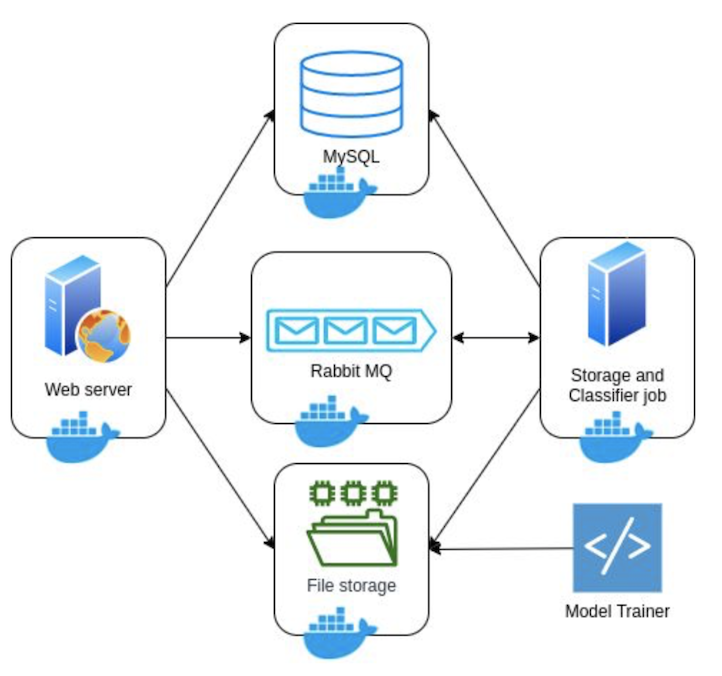

# ML Architecture ! 

This is an standard use case of a deployment architecture. The app is built with [Docker](https://www.docker.com), [Flask](http://flask.pocoo.org/), [RabbitMQ](https://www.rabbitmq.com) and [MySQL](https://www.mysql.com) on the backend.

### Running the app

There are two different ways of getting the app up and running:

####  Docker Compose
```
$ docker-compose up
```

####  Mannualy
If you choose this way, you must change the database host to "localhost" or the one that fit to your purposes, since it is setted up to run using Docker engine.

### Architecture

In the assignment folder, a file with the architecture design can be found.

